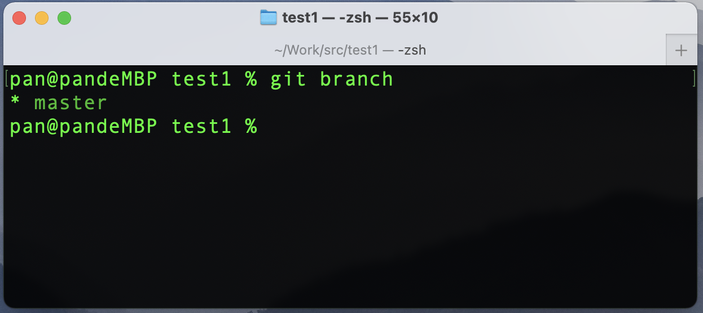
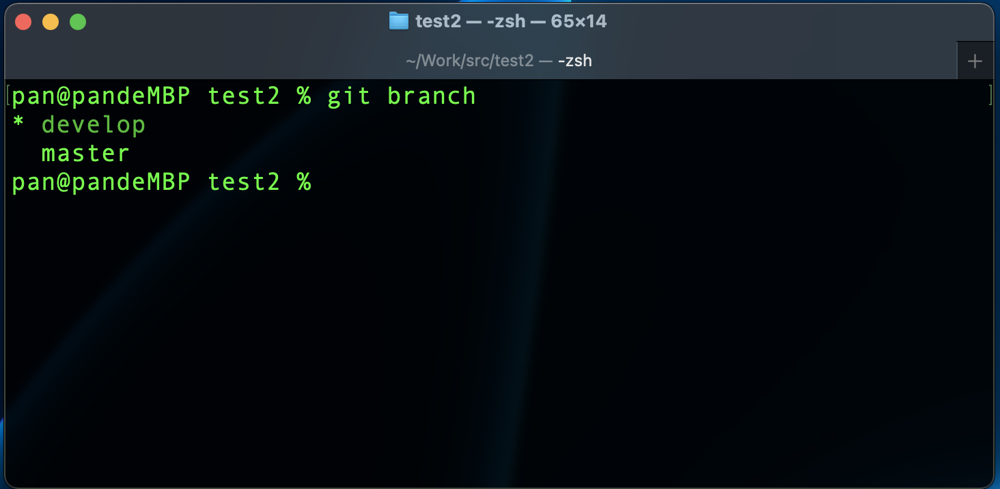
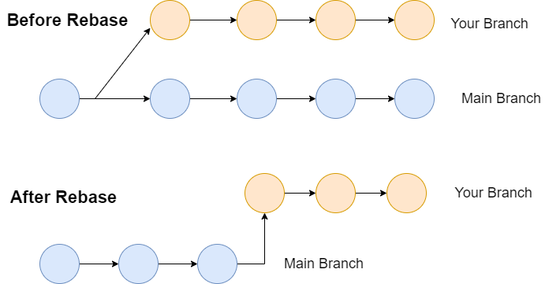
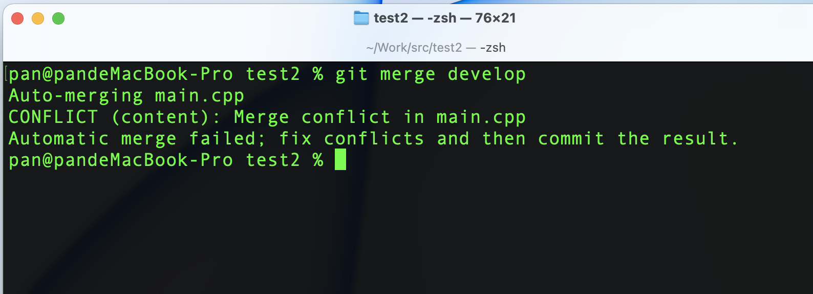

# 怎样使用Git进行协同开发？

## 一、概述

> 这篇文章是本系列的第 3 篇。通过前两篇，我们已经掌握了 git 的最常用的命令以及相关操作。在本篇文章，我们将学习企业开发中最常用的协同方式，那就是基于 git 分支进行协同开发。如果你还没有阅读过前两篇文章，建议先阅读。

- [Git的简介与基本操作方法](note-01.md)
- [通俗易懂地学习Git中最常用的指令](note-02.md)

## 二、git 分支

### 1. 分支简介


git 通过保存一系列不同时刻的文件快照，来记录文件在不同时刻的差异。git 的分支，本质上是指向提交对象的可变指针。 git 的默认分支名是 `master`。 在多次提交操作之后，你其实已经有一个指向最后那个提交对象的 `master` 分支。 `master` 分支会在每次提交时自动向前移动。

git 的 `master` 分支并不是一个特殊分支。 跟其它分支完全没有区别。 之所以几乎每一个仓库都有 `master` 分支，是因为 `git init` 命令默认创建它，并且大多数人都懒得去改动它。

不同的开发团队的分支管理规范不一样，但基本原理是相同的。下面是一个典型的 git 分支的工作流示例图


**Master**：这里指 `master` 主分支，`master` 分支记录的重大版本更新

**Develop**：这里指 `develop` 开发分支，从 `master` 分支创建，变动比较大，通常待上线的功能合并到这个分支

**Feature**：这里指 `feature` 功能分支，从 `develop` 分支创建，在这类分支上去开发新的功能。开发功能的时候，这个功能属于哪个目标发行版本还不知道。功能如果一直在开发，对应的这个功能分支就可以一直存在。待上线的时候，合并到 `develop` 分支上，进行功能测试。如果不想要开发的这个功能了，可以直接扔掉它。

### 2. 分支的基本操作

**（1）查看分支**

我们先通过以下命令查看分支信息

```shell
git branch
```

看到如下信息


**（2）创建与切换分支**

使用以下指令从当前分支创建新分支，并切换到新分支

```shell
# 创建develop分支
git branch develop
# 切换到 develop 分支
git checkout develop
```

或者我们使用以下命令创建之后直接切换到新分支

```shell
# checkout 指令使用 -b参数，创建之后即切换
git checkout -b develop
```

此时我们再使用 `git branch` 查看分支信息，如下图


可以看到现在一共有两个分支，而有“\*”标识的是我们现在所在的分支。

**（3）删除分支**

经过上面的操作，我们现在已经处在 `develop` 分支上，下面我们创建一个新分支，并删除掉新创建的分支

```shell
# 创建并切换到 feature/211031
git checkout -b feature/211031
```

通过上面的指令我们创建了一个功能分支，假如这个功能不想要了，我们就可以删除掉，使用以下指令

```shell
# 先切换回develop分支
git checkout develop
# 删除 feature/211031 功能分支
git branch -d feature/211031
```

删除远端分支，为了演示删除远端分支，我们先将本地的`develop`分支提交到远端

```shell
# 将本地develop 分支提交到远端
git push -u origin develop
```

如果远端没有 develop 分支将会自动创建。这里还有个参数是 `-u`，是`--set-upstream`的简写，该参数用于推送代码是进行分支关联，该参数与 `push`指令联用。另一个类似功能的参数`--set-upstream-to`用于直接设置关联，该参数与`branch`指令联用。如下指令

```shell
# 将远端 master 关联到 本地 develop分支
git branch --set-upstream-to origin/master develop
```

以上指令将远端 `master` 分支关联到本地的 `develop` 分支。换一种说法是，我们将本地 `develop` 分支追踪远端的 `master` 分支。以上的设置只是个示例，在实际中，根据分支名称，本地分支应当与远端分支一一对应。

上面讲`develop`分支推送到远端仓库之后，我们可执行远端的分支删除操作，如下指令

```shell
# 删除远端的 develop 分支
git push -u origin -d develop
```

> origin 关键词指的是一个指针，origin 指向的是本地的代码库托管在远端的仓库，可以说 origin 对应的是远端仓库。


### 3. 同步远端分支

**（1）相关指令**

使用下面的命令合并远端代码

```shell
# 从远程获取最新版本信息到本地
git fetch
# 将远端版本合并到当前分支
git merge FETCH_HEAD
```

这里出现一个关键词`FETCH_HEAD`，该关键词同样是一个指针，用于跟踪从远程存储库中获取的内容。

以上的两个指令可以用一个 `git pull`来代替， 其实就是 `git fetch` 和 `git merge FETCH_HEAD` 的合并。命令格式如下

```shell
git pull <远程主机名> <远程分支名>:<本地分支名>
```

**（2）实例**

让当前分支自动与其追踪的分支进行合并

```shell
git pull
```

让远端的 `master` 分支，与本地的 `develop` 分支合并，如下指令

```shell
git pull origin master:develop
```

### 4. 分支的合并

通常情况下，需要单独建一个分支来开发功能，开发完成之后需要合并到主分支。我们这里说的主分支是功能分支的来源分支，假如 `feature` 分支是从 `develop` 分支创建的，我们就把这里的 `develop` 分支叫做主分支。通过下图可以看到合并的过程


每个节点代表一个提交，但功能分支在开发的时候，主分支也可能进行了好几次提交。最后，功能分支要合并到主分支上。上图的合并过程可以通过以下命令来实现

```shell
# 切换到develop分支
git checkout develop
# 将feature分支合并到develop分支
git merge feature
```

但很多时候，我们需要另外的效果，如下图


将功能分支的提交记录追加在主分支上，让git保持一条线的提交记录，我们可以使用以下命令


```
# 使用rebase的方式将feature分支合并到develop分支
git rebase feature
```

`rebase` 的方式不是直接合并，而是将 `feature` 分支变化的提交记录直接追加到主分支之上。使得两个分支的代码保持提交的记录是一致的。

实际上不仅仅本地分支的合并可以使用`rebase`的方式。将远端代码合并到本地的分支，我们也可以使用`--rebase`参数将本地分支的提交记录追加到远端的分支上，如下命令

```shell
git pull --rebase
```

如果我们不希望合并整个分支，而是其他将其他分支的一个文件合并到我们当前分支，可以使用一下命令

```shell
git checkout 远程分支或者本地分支名 对应分支文件路径 当前分支文件路径
```

### 5. 代码冲突解决办法

因为 git 主要是用来做协同开发的，所以一个项目中的一个文件，可能同时有多个人编辑，那么就可能产生文件的冲突。冲突主要来自以下方面

- 多人同时变更相同文件的同一个地方：一定会产生冲突
- 多人同时编辑文件的不同地方：可能会产生冲突

如果产生的冲突 git 能处理的 git 将会自动解决，但是如果 git 不能解决的冲突则需要我们手动解决。下面我们演示一下文件产生冲突和解决的过程

**（1）初始化git仓库**

```shell
# 创建一个 test2 目录
mkdir test2
# 进入 test2 目录
cd test2
# 创建一个源代码文件 main.cpp
touch main.cpp
# 初始化git仓库
git init
# 将文件添加git缓存区
git add .
# 将git提交到版本库
git commit -m "first commit"
```

**（2）在新分支写入代码**

这时候，我们已经在 master 分支已经有了一个 git 的版本库。现在需要从 `master` 分支创建新分支，如下命令

```shell
git checkout -b develop
```

现在我们在`main.cpp`中添加以下代码

```cpp
#include<iostream>
```

然后将代码进行提交，如下指令

```shell
git commit -a
```

你可能会疑问，这次提交怎么跟之前的命令不一样呢？实际上，以上命令就等价于下面的指令

```shell
git add .
git commit
```

但是没有`-m`参数，所以 git 会自动打开其绑定的终端编辑器，让我们手动输信息。输好提交备注信息之后，我们退出编辑器即可。

**（2）在主分支上写入代码**

接着我们切换到 `master` 分支，如下指令

```shell
git checkout master
```

现在我们在 master 分支中对`main.cpp`文件添加另外一行代码，如下内容

```cpp
#include<stdlib.h>
```

再使用以下命令进行提交

```shell
git commit -a
```

**（3）产生冲突**

此时，`master` 分支到了第 2 个版本，`develop` 也在第 2 个版本，并且他们同一行文件代码不一样，代码合并后必定会产生冲突。接下来我们将 `develop` 分支合并到 `master`分支，如下命令

```shell
# 在master分支上将develop分支合并进来
git merge develop
```

合并结果如下图所示



可以看到提示信息的关键词`CONFLICT`，此时代码已经产生了 git 无法自动解决的冲突，合并之后的代码如下所示

```cpp
<<<<<<< HEAD
#include<stdlib.h>
=======
#include<iostream>
>>>>>>> develop
```

现在我们打开`main.cpp`文件，可以看到合并的代码中被分成了两栏。上面部分的关键词是`HEAD`，我们在前面说过 `HEAD`指针指向的是当前分支，即 master，而下面的部分是 develop 分支的代码。

**（4）解决冲突**

现在就需要我们手动解决冲突，假如我们两行代码都想要，那么删除掉 git 产生的临时行，同时保留两个分支的代码即可，最终修改如下：

```cpp
#include<stdlib.h>
#include<iostream>
```

最后，我们再将修改之后的代码再次提交到版本库即可，如下指令
```shell
git commit -a -m "解决冲突"
```


## 三、标签

git 可以对某次版本提交进行打标签，以表示一个重要更新或者是一个里程碑。一般情况下，我们在代码即将发布的时候打一个标签，以表示一个稳定的版本。

### 1. 查看标签

使用以下指令查看已经存在的标签

```shell
git tag
```

这个指令会根据标签的字母顺序列出，如果只想查看某个关键字的分支，可以使用以下指令

```shell
# 查看 带有 "v1." 关键字的标签 星号（"*"）代表通配符号
git tag -l "v1.*"
```

### 2. 打标签

git 支持两种标签：轻量标签（lightweight）与附注标签（annotated）。轻量标签很像一个不会改变的分支，它只是某个特定提交的引用。而附注标签是存储在 git 数据库中的一个完整对象。

使用当前分支最新的提交创建标签轻量标签

```shell
git tag v1.0 -m "version 1.0"
```

使用当前分支最新的提交创建附件标签

```shell
git tag -a v1.0 -m "version 2.0"
```

我们也可以对过去的提交进行打标签，使用以下指令查看过去的提交日志

```shell
git log --pretty=oneline
```

可以看到如下内容

```shell
pan@pandeMacBook-Pro test2 % git log --pretty=oneline
667a8a76e994f9abe0624d5b14093af92de16ac2 (HEAD -> master, tag: v2.0, tag: v1.0, origin/master, develop) Merge branch 'develop'
db8f7cf7cadcfbf357a93b4a1cab3ee25a86db85 main commit 2
f9715e2aae67cf66b1d1348e872cb313f25ed514 develop commit 1
ba8703bd5151796106af7fe55109c9d80ea8b27f first commit
```

假如我们需要对第一次版本提交打标签，可使用以下命令

```shell
# 使用提交id指定对应的提交
git tag -a v3.0 ba8703bd5151796106af7fe55109c9d80ea8b27f -m "tag v3.0"
```

或者直接用提交 id 的缩写，如下指令

```shell
git tag -a v3.0 ba8703b -m "tag v3.1"
```

### 3. 将标签提交到服务器

我们在使用`push`指令的时候，并不会直接将标签远端仓库，所以我们需要使用如下指令提交对应的标签

```shell
# 将 名为 v2.0 的标签提交到远端仓库
git push origin v2.0
```

或者使用以下指令将所有的标签提交到远端仓库

```shell
git push origin --tags
```

### 4. 删除标签

使用以下命令删除本地标签
```shell
git tag -d v1.0
```

本地标签删除后，如果远端存在当前对应标签，使用`git pull`同时将远端标签同步到本地。我们可以使用下面的命令删除远端标签

```shell
# 删除远端仓库的 v1.0 标签
git push origin :refs/tags/v1.0
```

上面这种操作的含义是，将冒号前面的空值推送到远程标签名，从而高效地删除它。如果使用下面的指令删除远端标签，更加直观

```
# 删除远端 v1.0 标签，-d 是 --delete 的缩写，两者的功能是等价的
git push origin --delete v1.0
```

这时候，你可能会疑问：删除分支和删除标签的命令是一样的？确实是，因为这种方式是通过引用名称进行删除。如果存在同名分支时，使用上述的第二种方法删除标签会删除失败。


同时我们也说明一下删除分支的原始指令，如下

```shell
# 删除 develop 分支
git push origin :refs/heads/develop
```

> 从上面的指令我们可以看出，分支的引用属于 `refs/heads` 之下，而标签的引用属于 `refs/tags` 之下
>


## 四、总结

通过这篇文章，我们把常见的 git 协同开发操作都演示了一遍。我们主要是以实践的方式进行了代码的合并、代码的提交、冲突的解决、标签的使用等。如果掌握这篇文章，几乎就能满足日常的开发git协作需求了。

实际上`git`的功能也不止这些，限于篇幅，git还有很多不常用的参数和功能这篇文章没有介绍。如果你有兴趣，可以通过阅读官方文档的方式了解更多内容！
