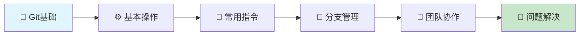

# Git 实战教程 - 从入门到团队协作

!!! tip "🎯 为什么要学Git？"
    Git是现代软件开发的必备工具！本教程通过实际案例和操作演示，帮你快速掌握Git的核心功能，轻松应对日常开发和团队协作场景。

## 🚀 你将学到什么？

-   :material-rocket-launch: **快速入门**

    ---

    从Git基本概念开始，通过实际操作快速上手

    [:octicons-arrow-right-24: 立即开始](git/note-01.md)

-   :material-console-line: **实用指令**

    ---

    掌握日常开发中最常用的Git操作和命令

    [:octicons-arrow-right-24: 查看指令](git/note-02.md)

-   :material-account-group: **团队协作**

    ---

    学会分支管理和代码合并，提升团队开发效率

    [:octicons-arrow-right-24: 学习协作](git/note-03.md)

-   :material-backup-restore: **问题解决**

    ---

    掌握版本回退技巧，轻松处理代码问题

    [:octicons-arrow-right-24: 掌握回退](git/note-04.md)

## 💡 学习路径

## 📖 教程大纲

| 章节 | 标题 | 难度 | 时长 | 核心内容 |
|------|------|------|------|----------|
| 01 | [🚀 Git基础入门](git/note-01.md) | ⭐ | 30分钟 | Git概念、安装、初始化、基本工作流 |
| 02 | [⚡ 实用Git指令](git/note-02.md) | ⭐⭐ | 45分钟 | add、commit、push、pull等核心命令 |
| 03 | [👥 团队协作实战](git/note-03.md) | ⭐⭐⭐ | 60分钟 | 分支创建、合并、冲突解决 |
| 04 | [🔄 版本回退技巧](git/note-04.md) | ⭐⭐⭐ | 45分钟 | reset、revert、代码恢复 |

!!! success "🎓 学完你将掌握"
    - ✅ Git的基本概念和工作原理
    - ✅ 日常开发中的Git操作技巧  
    - ✅ 团队协作的分支管理流程
    - ✅ 常见问题的解决方法

## 🔥 教程特色

=== "💯 实战导向"
    每个知识点都配有实际操作示例，学完就能用

=== "🎯 循序渐进"
    从零基础到实际应用，学习路径清晰明确

=== "👥 贴近实际"
    涵盖真实开发中的常见场景和解决方案

=== "🚀 快速上手"
    精选核心知识点，避免信息过载，快速掌握

## 🎯 适合人群

- 🔰 **编程新手**: 想要学习版本控制的基础知识
- 💻 **开发者**: 需要提升Git使用技能
- 👥 **团队成员**: 想要改善团队协作效率
- 🎓 **学生**: 准备进入软件开发行业

---

**🌟 开始你的Git学习之旅吧！** | 原创内容来自公众号作者 **极客开发者**